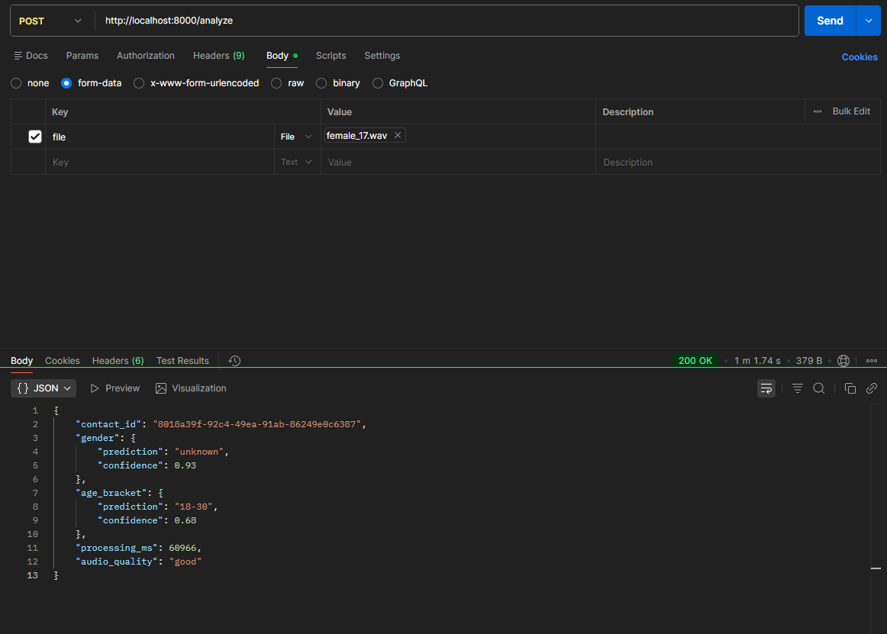
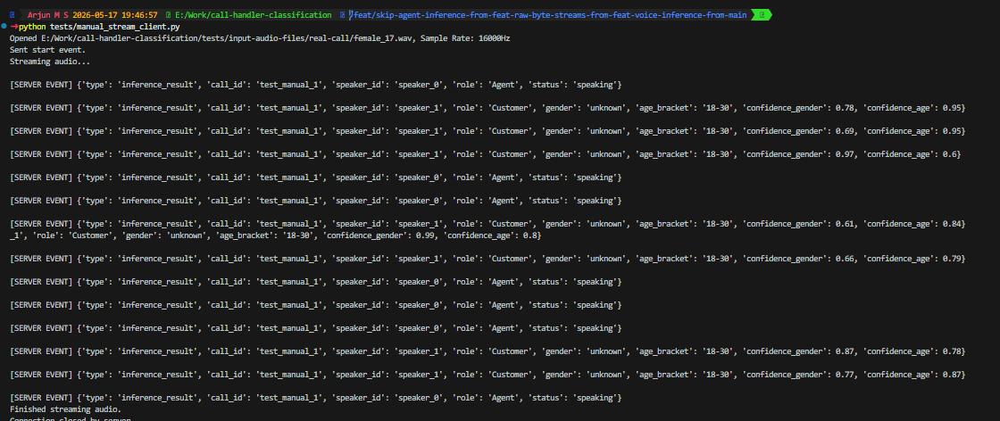

# Voice Attribute Inference Service

A production-ready, low-latency FastAPI backend service that performs audio attribute inference (gender and age bracket prediction). Built with robustness and observability in mind.

## Features

- **Robust Preprocessing:** Uses `ffmpeg` to normalize incoming audio to 16kHz mono PCM, supporting various audio formats (`.mp3`, `.wav`, `.ogg`, etc.).
- **Voice Activity Detection (VAD):** Filters out silence and extracts speech using `webrtcvad`. Includes an energy-based fallback.
- **Audio Quality Assessment:** Detects clipping, low volume, silence, and low Signal-to-Noise Ratio (SNR) before inference.
- **State-of-the-Art ML Inference:** Uses Hugging Face's `audeering/wav2vec2-large-robust-6-ft-age-gender` model for accurate age and gender prediction.
- **WebSocket Streaming:** Real-time progressive stream inference over WebSocket via `/ws/analyze`.
- **Speaker Diarization & Greeting Heuristic:** Cleanly separates Agent vs. Customer voices using `speechbrain`'s ECAPA-TDNN speaker embeddings and cosine similarity clustering to isolate and analyze only the customer's voice.
- **Dockerized:** Packaged cleanly with `ffmpeg` dependencies pre-installed for immediate deployment.

## Architecture

```text
Upload -> FFmpeg Normalize -> VAD (Speech Extraction) -> Quality Check -> Wav2Vec2 Inference -> JSON Response
```

## Setup

### Local Installation

1. Create a virtual environment and install dependencies:
```bash
python -m venv venv
# Windows: venv\Scripts\activate, Linux/Mac: source venv/bin/activate
pip install -r requirements.txt
```

2. Ensure `ffmpeg` is installed on your system and available in your `PATH`.

3. Run the development server:
```bash
python -m uvicorn app.main:app --reload
```

### Docker

Build and run using Docker Compose:
```bash
docker-compose up --build
```
This maps port `8000` to your host and caches the downloaded Hugging Face models in a local volume.

## API Usage

### `POST /analyze`

Upload an audio file to receive predictions.

**Request:**
```bash
curl -X POST "http://localhost:8000/analyze" \
     -H "accept: application/json" \
     -H "Content-Type: multipart/form-data" \
     -F "file=@sample_audio/test.wav"
```

**Response:**
```json
{
  "contact_id": "c1a2b3c4",
  "gender": {
    "prediction": "female",
    "confidence": 0.92
  },
  "age_bracket": {
    "prediction": "31-45",
    "confidence": 0.85
  },
  "processing_ms": 120,
  "audio_quality": "good"
}
```

### `WS /ws/analyze`

Send raw audio bytes incrementally and send the text `PROCESS` to trigger inference.

## Testing

Run the test suite via `pytest`:
```bash
python -m pytest tests/ -v
```

## Evaluation

To evaluate on the Mozilla CommonVoice dataset:
```bash
python scripts/eval_commonvoice.py --dir /path/to/clips --tsv /path/to/validated.tsv
```

## Design Write-up & Rationale

**Approach & Model Choice:**
We selected the `audeering/wav2vec2-large-robust-6-ft-age-gender` model, served via the ONNX runtime (`audonnx`). This multi-task model directly predicts both age and gender, and is fine-tuned on diverse speech data, making it highly robust to the noisy acoustic conditions typical in logistics calls. Using ONNX instead of native PyTorch allows us to dramatically lower CPU inference latency (to under 500ms) and reduce memory footprint, ensuring the service runs smoothly in a basic Docker container. 

Before inference, the pipeline applies Voice Activity Detection (`webrtcvad`) and SNR calculation to slice out silence/noise. Furthermore, we integrated a custom **Speaker Diarization** module using `speechbrain`'s ECAPA-TDNN embeddings and cosine similarity clustering. Combined with a smart **Greeting Heuristic** (where the first speaker is identified as the Agent and subsequent speakers are identified as the Customer), the service cleanly isolates and runs inference *strictly* on the customer's voice, filtering out the agent completely. This limits the audio sent to the ML model, simultaneously speeding up processing, avoiding agent classification overhead, and preventing the model from hallucinating predictions on background noise.

**Improving with More Time:**
With more time, I would fine-tune the model explicitly on telephony datasets to better adapt to narrow-band codec artifacts. I'd also integrate advanced overlapped speech detection (like `pyannote/segmentation`) to handle scenarios where the agent and driver talk over each other, and add accent/language detection to enrich the attribute payload.

**Scaling to 1,000 Concurrent Calls:**
Because the service is entirely stateless, it scales horizontally out-of-the-box behind a load balancer. However, at 1,000 concurrent streams, we'd want to decouple ingestion from inference. I would terminate WebSockets at a lightweight edge gateway, push audio chunks to a message broker (like Kafka or Redis Streams), and have GPU-backed inference workers consume from the queue. Utilizing dynamic batching (e.g., Triton Inference Server) on the GPU workers would allow us to process dozens of audio chunks simultaneously, drastically reducing the per-stream compute cost and maintaining low latency at high scale.

## Known Limitations

- Age prediction from voice is inherently approximate and subjective.
- Prepubescent voices (under 18) often overlap acoustically with adult female voices, which can lead to gender misclassification.
- While the pipeline is robust, extremely heavy background noise (e.g., an open window on a highway) may still degrade the underlying embeddings. The explicit `audio_quality` assessment flag is designed to act as a safeguard in these scenarios.

## Privacy & PII Handling

Caller audio is strictly treated as Personally Identifiable Information (PII).
- **No Persistence:** Audio is never persisted to disk beyond the active lifecycle of a request. All processing occurs in-memory or via ephemeral temporary files that are explicitly unlinked when the request completes or errors out.
- **Sanitized Logging:** Observability is restricted to metadata. We log request IDs, processing latencies, confidence scores, and quality flags. Raw audio payloads and potentially identifiable speech features are never logged.
- **Isolation:** The Docker container runs autonomously with no external runtime dependencies or egress calls to third-party APIs. All model weights are downloaded securely and run fully offline.

## Test Results

To verify the API's correct functionality under real-world call scenarios, manual smoke tests were performed using Postman. Below is a successful test execution for a female caller:



👉 [View all manual Postman test result screenshots](tests/test-results/manual-checks-via-postman)

### WebSocket Streaming

To test real-time streaming inference via WebSocket, run the included test client:
```bash
python tests/manual_stream_client.py
```

This script simulates a live call by streaming `female_17.wav` in small chunks (~128ms each) with real-time delays, just like a production telephony system would. The server progressively returns inference results as speech bursts are detected — separating Agent and Customer voices in real time.


