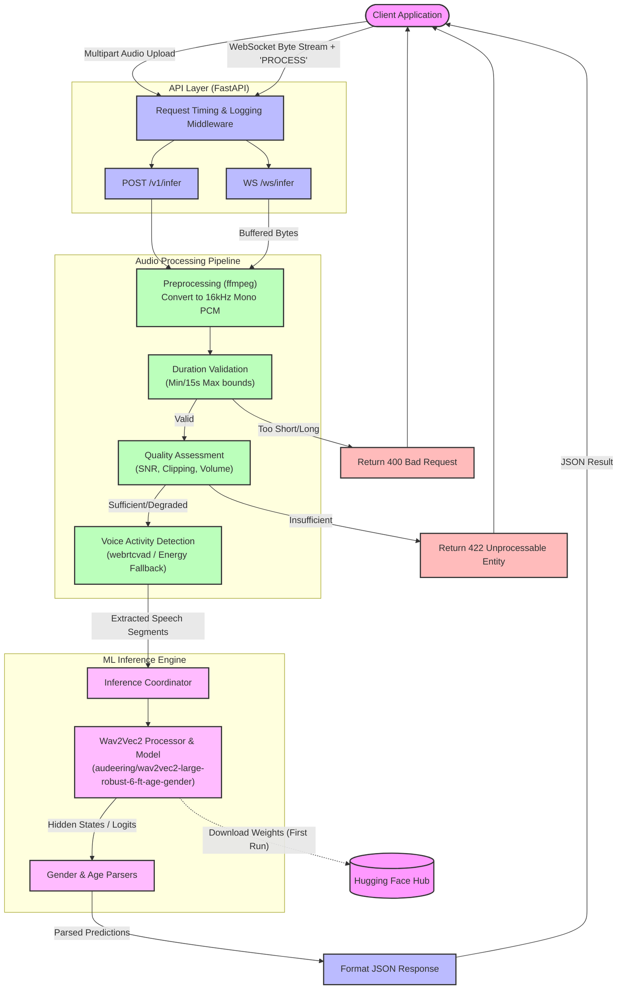

# Voice Attribute Inference Service Architecture

This document outlines the detailed architecture and request lifecycle of the Voice Attribute Inference Service.

## Request Lifecycle

## Component Details

1. **FastAPI Server (`app/main.py` & `app/api/`)**: Handles incoming HTTP and WebSocket requests. Responsible for request-level validation, logging, and performance timing (via middleware).
2. **Audio Preprocessing (`app/audio/preprocess.py`)**: Accepts various audio formats (MP3, WAV, OGG, WebM) and uses `ffmpeg` to securely and efficiently standardize them to the 16kHz Mono PCM format required by the ML model.
3. **Audio Quality (`app/audio/quality.py`)**: Calculates Signal-to-Noise Ratio (SNR), clipping occurrences, and silence ratios. It tags the request with metadata ("good", "degraded", "insufficient") allowing the API to reject completely unusable audio early.
4. **Voice Activity Detection (`app/audio/vad.py`)**: Employs `webrtcvad` to trim non-speech segments from the normalized audio, ensuring the ML model only processes segments containing actual human voice. It includes a graceful fallback to a simpler energy-based VAD if webrtc compilation fails in certain environments.
5. **Inference Engine (`app/inference/pipeline.py`)**: Loads the heavy `wav2vec2` transformer models into memory once at startup (or on the first request). It processes the speech segments and interprets the resultant output logits into structured human-readable JSON formats containing `prediction` strings and `confidence` scores (0.0 to 1.0) for both Gender and Age bracket.

## Future Roadmap
- [ ] GPU-accelerated inference support
- [ ] Multilingual/Accent detection support
- [ ] Speaker Diarization (Agent vs Customer separation)
- [ ] Real-time progressive inference for WebSockets
