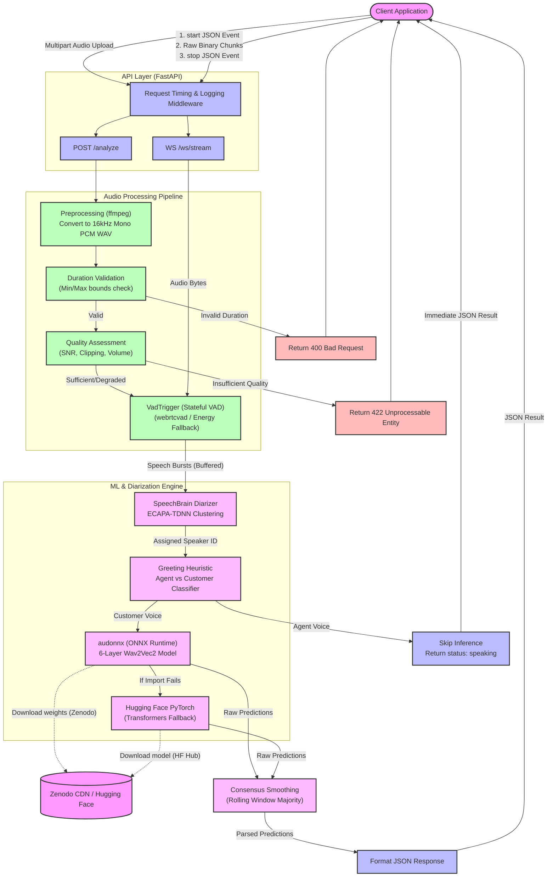

# Voice Attribute Inference Service Architecture

This document outlines the detailed architecture, component structure, and request lifecycle of the Voice Attribute Inference Service.

---

## Request Lifecycle

The system supports two primary integration flows:
1. **REST Inference (`POST /analyze`)**: A batch endpoint that accepts complete conversational audio files, standardizes them, isolates the customer's speech segments, and returns a single analysis.
2. **WebSocket Streaming (`WS /ws/stream`)**: A real-time endpoint that statefully processes continuous audio chunks, segments them into speech bursts via Voice Activity Detection, diarizes each speaker, and dynamically emits results as they occur.

---

## Component Details

### 1. FastAPI Server (`app/main.py` & `app/api/`)
Handles routing, request lifecycle validation, and client communication.
*   **`POST /analyze`**: Direct file uploads are ingested, temporarily written to disk for processing, validated, and normalized before inference.
*   **`WS /ws/stream`**: Establishes full-duplex WebSocket connections. Handshakes must begin with a text-based `WebSocketStartEvent` JSON (specifying `call_id`, `sample_rate`, and `encoding`), followed by raw binary audio chunks. Sessions are terminated by a `{"type": "stop"}` text event or disconnection.
*   **Middleware**: A request-level middleware tracks performance metrics, captures response latencies (`processing_ms`), and ensures clean exception handling.

### 2. Audio Preprocessing (`app/audio/preprocess.py`)
Standardizes input files (MP3, WAV, WebM, FLAC, M4A, etc.) to the fixed format expected by downstream audio analysis and machine learning models.
*   **Target Format**: 16kHz, Single Channel (Mono), 16-bit PCM WAV.
*   **Engine**: Invokes `ffmpeg` asynchronously to securely handle variable codecs and downmix multi-channel sources.

### 3. Audio Quality Assessment (`app/audio/quality.py`)
Computes signal health metrics from the raw NumPy float32 arrays to protect inference accuracy:
*   **Clipping Rate**: Measures occurrences of signal saturation.
*   **Signal-to-Noise Ratio (SNR)**: Evaluates background noise levels.
*   **Volume & Silence**: Checks for muted or completely silent tracks.
*   **Rejection**: Automatically flags files as `"good"`, `"degraded"`, or `"insufficient"`. Unusable audio is rejected immediately (`422 Unprocessable Entity`).

### 4. Voice Activity Detection (`app/audio/vad.py`)
Removes non-speech intervals (dead air, background hums) to maximize throughput and save compute costs.
*   **`extract_speech`**: Batch-based VAD that isolates and concatenates voiced speech frames.
*   **`VadTrigger`**: A stateful streaming VAD that processes incoming audio chunks. It accumulates frames during active speech and triggers a complete **speech burst** (a single continuous utterance) only after detecting a brief pause (e.g., `500ms` of silence).
*   **Fallback Mechanism**: Attempts high-accuracy Google WebRTC VAD (`webrtcvad`) first; gracefully falls back to an energy-threshold-based VAD if local compilation is unavailable.

### 5. Speaker Diarization & Role Labeling (`app/inference/diarizer.py` & `app/audio/stream_session.py`)
*   **`Diarizer`**: A clustering component using pre-trained **SpeechBrain ECAPA-TDNN** speaker embeddings (`speechbrain/spkrec-ecapa-voxceleb`). It calculates speaker centroids on the fly and clusters speech bursts based on cosine similarity thresholds to isolate individual voices.
*   **Greeting Heuristic**: In outbound call centers, the first speaker to speak is assumed to be the **Agent**, and subsequent speakers are identified as the **Customer**. 
*   **Inference Avoidance**: To save resources, inference is bypassed for the Agent's speech bursts. The model only analyzes customer speech.
*   **Single-Speaker Correction**: If a recording features only one speaker, the finalizer automatically corrects their role to "Customer" and runs inference on their voice.

### 6. Inference Pipeline (`app/inference/pipeline.py`)
Loads models and processes speech bursts to output age and gender predictions.
*   **Primary ONNX Engine**: Powered by **ONNX Runtime (`audonnx`)** running a custom 6-layer Wav2Vec2 model. Model weights are downloaded securely from Zenodo, cached locally, and loaded into CPU memory once at startup.
*   **Fallback PyTorch Engine**: Uses the full Hugging Face `transformers` library (`audeering/wav2vec2-large-robust-6-ft-age-gender`) if `audonnx` is missing.
*   **Consensus Smoothing**: For streaming sessions, individual raw predictions are stored in a rolling buffer (default size `5`). A majority vote (consensus) is calculated to prevent voice noise or short bursts from causing erratic predictions.

---

## Future Roadmap

- [ ] GPU-accelerated inference support (V100/T4 optimization)
- [ ] Multilingual/Accent detection support (extending Wav2Vec2 heads)
- [ ] Real-time progressive progressive classification (within active bursts)
